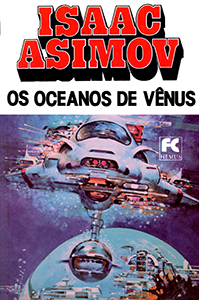

# epubs_fc_hemus

## O projeto

A **Hemus - Editora e Livraria**, na década de 1970, traduziu e publicou vários livros de ficção científica, a maioria de Isaac Asimov. As traduções foram realizadas por várias pessoas diferentes, e na época ainda não era usado o ISBN no Brasil para identificar livros. Na década de 80, a coleção foi expandida posteriormente e quase todos os livros foram relançados com uma nova capa, mais moderna, com uma faixa branca contendo o nome do autor e do livro. Essas versões novas usavam arte de outros livros da época, ocultando o nome do artista.

Algumas das traduções desses clássicos tem mais de 50 anos, e, se encontrados, estão em estado bem desgastado.

A **Hemus** foi sucedida pela **Editora Record**, que inclusive lançou uma versão nacional da *Isaac Asimov Magazine* com 25 edições publicadas. Atualmente a **Aleph** tem publicado novas traduções das séries Império Galáctico, Robôs e Fundação de Isaac Asimov.

Nas versões da Hemus, vários títulos foram adaptados. Por exemplo, *The Caves of Steel* virou *Caça aos Robôs*.

Edições originais:

Reedições e novos lançamentos:

Em Novembro de 2025, comecei a scanear e preservar digitalmente as versões atualizadas da Hemus, para ler no Kindle. Comecei com os livros do Asimov, e se conseguir, continuarei com os outros livros.

Estou digitalizando com um scanner de mesa OpticBook 3800L, e usando o software que acompanhou o scanner (Abbyy Fine Reader 12 Sprint) para fazer o OCR.

Estou fazendo versões em EPUB, porque podem ser facilmente editados e convertidos para outros formatos. Para gerar os epub, basta navegar até a pasta `src` e rodar o script de PowerShell `build.ps1`.

A melhor forma de ler no Kindle é pegar o EPUB e usar o recurso Send to Kindle (https://www.amazon.com.br/sendtokindle), que será automaticamente convertido e enviado para seu Kindle. Caso tenha ativado o recursos de ver a capa do livro quando desligar o Kindle, funciona corretamente, assim como fontes embarcadas no livro.

Existe um software gratuito que pode fazer a conversão, mas não tenho tido resultados tão bons, além do fato dele adicionar um monte de porcaria no código fonte do livro, e de você precisar transferir para o Kindle por esse software para funcionar a capa do livro.

## Relação de Livros

No final dos livros existe uma relação de títulos, que foi usado para compilar esta lista. Nas informações dos livros normalmente não existe uma data de publicação da edição (ou das várias edições) nacionais, e alguns dos livros tiveram capas diferentes durante sua existência:

A segunda capa de Os Robôs usa a ilustração da capa da primeira edição da Hemus, e a terceira usa a ilustração da contracapa.

Aqui está uma lista dos livros da série FC Hemus em ordem alfabética por autor e título (alguns títulos originais precisam ser verificadas e estão sinalizada com `(*)`):

| Título                           | Autor                 | Tradução | Título Original                              | Ano de Publicação Original |
| -------------------------------- | --------------------- | -------- | -------------------------------------------- | -------------------------- |
| **827 Era Galáctica**            | Isaac Asimov          |          | Pebble in the Sky                            | 1950                       |
| **A Terra Tem Espaço**           | Isaac Asimov          |          | Earth  is Room Enough                        | 1957                       |
| **As Cavernas de Marte**         | Isaac Asimov          |          | David Starr, Space Ranger                    | 1952                       |
| **As Correntes do Espaço**       | Isaac Asimov          |          | The Currents of Space                        | 1952                       |
| **Caça aos Robôs**               | Isaac Asimov          |          | The Caves of Steel                           | 1954                       |
| **Despertar dos Deuses**         | Isaac Asimov          |          | The Gods Themselves                          | 1972                       |
| **Fim da Eternidade**            | Isaac Asimov          |          | The End of Eternity                          | 1955                       |
| Fundação                         | Isaac Asimov          |          | Foundation Trilogy                           | 1951-1953                  |
| **Fundação II**                  | Isaac Asimov          |          | Foundation’s Edge                            | 1982                       |
| **Júpiter à Venda**              | Isaac Asimov          |          | Buy Jupiter                                  | 1975                       |
| Nós Robôs                        | Isaac Asimov          |          | The Complete Robot                           | 1982                       |
| **Nós, os Marcianos**            | Isaac Asimov          |          | The Martian Way and Other Stories            | 1955                       |
| **O Cair da Noite**              | Isaac Asimov          |          | Nightfall and Other Stories                  | 1969                       |
| **O Futuro Começou**             | Isaac Asimov          |          | The Early Asimov                             | 1972                       |
| **O Grande Sol de Mercúrio** (1) | Isaac Asimov          |          | Lucky Starr and the Big Sun of Mercury       | 1956                       |
| **O Homem Bicentenário**         | Isaac Asimov          |          | The Bicentennial Man and Other Stories       | 1976                       |
| **O Robô de Júpiter**            | Isaac Asimov          |          | Lucky Starr and the Moons of Jupiter         | 1957                       |
| **Os Anéis de Saturno**          | Isaac Asimov          |          | Lucky Starr and the Rings of Saturn          | 1958                       |
| **Os Oceanos de Vênus**          | Isaac Asimov          |          | Lucky Starr and the Oceans of Venus          | 1954                       |
| **Os Robôs**                     | Isaac Asimov          |          | The Naked Sun                                | 1957                       |
| **Para Onde Vamos?**             | Isaac Asimov          |          | Where Do We Go From Here?                    | 1971                       |
| **Vigilante das Estrelas**       | Isaac Asimov          |          | Lucky Starr and the Pirates of the Asteroids | 1953                       |
| Essas Estrelas São Nossas        | Poul Anderson         |          | We Claim These Stars!                        | 1959                       |
| Guerra dos Homens Alados         | Poul Anderson         |          | War of the Wing-Men                          | 1958                       |
| **Luz de Outra Dimensão**        | Lloyd Biggle Jr.      |          | The Light That Never Was                     | 1972                       |
| **250 Séculos Após...**          | James Blish           |          | Midsummer Century                            | 1972                       |
| A Cidade Perdida de Marte        | Ray Bradbury          |          | I Sing the Body Electric                     |                            |
| E de Espaço                      | Ray Bradbury          |          | S is for Space                               | 1966                       |
| **F de  Foguete**                | Ray Bradbury          |          | R is for Rocket                              | 1962                       |
| O Terceiro Planeta               | Arthur C. Clarke      |          | Report on Planet Three (*)                   | 1972                       |
| A Humanidade Artificial          | Edmund Cooper         |          | The Overman Culture (*)                      | 1971                       |
| Cavalo-Marinho no Céu            | Edmund Cooper         |          | Seahorse in the Sky                          | 1969                       |
| O Diabólico Cérebro Eletrônico   | David Gerrold         |          | When Harlie Was One (*)                      | 1972                       |
| **Os Homens Moleculares**        | Fred e Geoffrey Hoyle |          | The Molecule Men                             | 1971                       |
| O Terror Rithiano                | Damon Knight          |          | The Rithian Terror                           | 1965                       |
| Os Cérebros Prateados            | Fritz Leiber          |          | The Silver Eggheads                          | 1961                       |
| **Nave Escrava**                 | Frederick Pohl        |          | Slave Ship                                   | 1956                       |
| Boneca do Destino                | Clifford D. Simak     |          | Destiny Doll                                 | 1971                       |
| Cei, o Gigante                   | Curt Siodmak          |          | City in the Sky (*)                          | 1974                       |
| **Venus Mais X**                 | Theodore Sturgeon     |          | Venus Plus X                                 | 1960                       |

(1) Nas primeira edições e dentro do livro, o título aparece como "O Grande Sol de Mercúrio". Na capa das últimas edições aparece só "Grande Sol de Mercúrio"

## Capas das Reedições

Nas versões nacionais de livros, geralmente as ilustrações são as mesmas das publicações originais, mas neste caso foram aproveitadas de outros livros também. O artista não está creditado na maioria dos livros, e não sei se eram obtidas permissões para uso das imagens, pois foram cortadas as assinaturas dos artistas na maioria das capas. Pesquisando, consegui levantar a seguinte relação de artistas, e onde a arte foi originalmente usada.

Em várias das reedições, ainda consta o nome do artista da versão original na página de Copyright (Edu, ou Decio Guedes), indicando que o miolo provavelmente é da primeira edição, e que foi encadernado novamente.

| Título                                                       | Artista            | Publicação Original                                          |
| ------------------------------------------------------------ | ------------------ | ------------------------------------------------------------ |
| **827 Era Galáctica**  | Paul Lehr          | Pebble in the Sky (Fawcett, 1971)  |
| **A Terra Tem Espaço**  | Chris Foss         | The Early Asimov Volume 2 (Panther, 1974 )  |
| **As Cavernas de Marte**  | Paul Lehr          | Nine Tomorrows (Fawcett, 1969)  |
| **As Correntes do Espaço**  | Frank Kelly Freas  | AudioLP The Green Hills of Earth (Caedmon Records, 1977)  |
| **Caça aos Robôs**                                           | John Berkey        | I, Robot (Fawcett, 1970)         |
| **Despertar dos Deuses**                                     |                    | The Best of Isaac Asimov (Fawcett, 1976)           |
| **Fim da Eternidade**                                        | Chris Foss         | Foundation and Empire (Panther, 1973)  |
| Fundação                                                     | Paul Lehr          | The Stars Like Dust (Fawcett, 1972)  |
| **Fundação II**                                              | Dickran Palulian   | Omni Magazine - Outubro 1982                                 |
| **Júpiter à Venda**  | Eddie Jones        | The Best of Trek (Signet, 1978)  |
| Nós Robôs                                                    | Michael Whelan     | Time and Again (Ace, 1976)  |
| **Nós, os Marcianos**  | Paul Lehr          | The Asutra (Dell, 1974)       |
| **O Cair da Noite**  | Tim White          | Through a Glass Clearly (New English Library, 1978)  |
| **O Futuro Começou**  |                    | I, Robot (Panther, 1969)      |
| **O Grande Sol de Mercúrio** (1)  | Paul Lehr          | The End of Eternity (Fawcett, 1971)  |
| **O Homem Bicentenário**                                     | Richard Cohen      | Omni Magazine - Maio 1980                                    |
| **O Robô de Júpiter**                                        | John Berney        | Lucky Starr and the Moons of Jupiter (Fawcett, 1978)  |
| **Os Anéis de Saturno**                                      |                    |                                                              |
| **Os Oceanos de Vênus**  | Don Maitz          | Lucky Starr and the Oceans of Venus (Fawcett, 1978)  |
| **Os Robôs**                                                 | Décio Guedes       | Arte Original, 1974             |
| **Para Onde Vamos?**  | Jack Faragasso     | The Three Stigmata of Palmer Eldritch (MacFadden, 1966)  |
| **Vigilante das Estrelas**                                   | Peter Andrew Jones | Buy Jupiter (Panther, 1975)  |
| Essas Estrelas São Nossas                                    | Vincent DiFate     | Analog Science Fiction - Abril 1977  |
| Guerra dos Homens Alados                                     | Ken Barr           | Hot Stuff #4 (1977)          |
| **Luz de Outra Dimensão**  | H. R. Van Dongen   | The Siege of Wonder (DAW, 1976)  |
| **250 Séculos Após...**  | Vincent DiFate     | Pintura de Urban Monad 116 - 1980  |
| A Cidade Perdida de Marte                                    | Décio Guedes       | Arte original, 1975                                          |
| E de Espaço                                                  | Chris Foss         | Foundation (Panther, 1960)    |
| **F de  Foguete**     | Chris Foss         | The Early Asimov Volume 1 (Panther, 1973)  |
| O Terceiro Planeta                                           | Paul  Lehr         | The Martian Way and Other Stories (Fawcett, 1969)  |
| A Humanidade Artificial                                      | Bruce Pennington   | Equator and Segregation (New English Library, 1973)  |
| Cavalo-Marinho no Céu                                        | John Berkey        | Lucky Starr and the Pirates of the Asteroids (Fawcett, 1978)  |
| O Diabólico Cérebro Eletrônico                               | Vincent DiFate     | Double Star (Signet, 1979)   |
| **Os Homens Moleculares**  | John Berkey        | The Caves of Steel (Fawcett, 1972)  |
| O Terror Rithiano                                            | Dean Ellis         | To Live Forever (Ballantine, 1976)  |
| Os Cérebros Prateados                                        | Nick Aristovulos   | In the Wake of Man (Bobbs-Merrill, 1975)  |
| **Nave Escrava**      | Robert Foster      | Slave Ship (Ballantine, 1969)  |
| Boneca do Destino                                            |                    | We Who Are About To (Dell, 1977)                             |
| Cei, o Gigante                                               | Vincent DiFate     | The Best of Philip K Dick (Ballantine, 1977)  |
| **Venus Mais X**      | Paul Lehr          | Earth is Room Enough (Fawcett, 1970)  |

## Andamento do projeto

Vou atualizando este documento conforme as atividades são executadas.

### Resumo

|             | Realizado | %    |
| ----------- | --------- | ---- |
| Páginas     | 9906      | 100  |
| Localizado  | 8483      | 85,6 |
| Scaneadas   | 2786      | 35,8 |
| Convertidas | 1086      | 10,9 |
| Revisadas   | 269       | 2,7  |

### Detalhado

| Título                         | Páginas | Localizado | Scan    | OCR  | EPUB | Revisado |
| ------------------------------ | ------- | ---------- | ------- | ---- | ---- | -------- |
| **827 Era Galáctica**          | 234     | ✅          | ✅       | ✅    | ✅    |          |
| **A Terra Tem Espaço**         | 206     | ✅          | ✅       | ✅    |      |          |
| **As Cavernas de Marte**       | 142     | ✅          | ✅       | ✅    |      |          |
| **As Correntes do Espaço**     | 206     | ✅          | ✅       | ✅    |      |          |
| **Caça aos Robôs**             | 296     | ✅          |         |      |      |          |
| **Despertar dos Deuses**       | 272     | ✅          | ✅       | ✅    |      |          |
| **Fim da Eternidade**          | 248     | ✅          | 246 (1) |      |      |          |
| Fundação                       | 503     | ✅          |         |      |      |          |
| **Fundação II**                | 372     | ✅          | 370 (2) |      |      |          |
| **Júpiter à Venda**            | 236     | ✅          | ✅       | ✅    | ✅    |          |
| Nós Robôs                      | 559     |            |         |      |      |          |
| **Nós, os Marcianos**          | 256     | ✅          | ✅       | ✅    |      |          |
| **O Cair da Noite**            | 378     | ✅          | ✅       | ✅    | ✅    | 187      |
| **O Futuro Começou**           | 470     | ✅          |         |      |      |          |
| **O Grande Sol de Mercúrio**   | 193     | ✅          | ✅       | ✅    |      |          |
| **O Homem Bicentenário**       | 238     | ✅          | ✅       | ✅    | ✅    | 82       |
| **O Robô de Júpiter**          | 142     | ✅          |         |      |      |          |
| **Os Anéis de Saturno**        | 234     | ✅          |         |      |      |          |
| **Os Oceanos de Vênus**        | 190     | ✅          | ✅       | ✅    |      |          |
| **Os Robôs**                   | 146     | ✅          |         |      |      |          |
| **Para Onde Vamos?**           | 374     | ✅          | ✅       | ✅    |      |          |
| **Vigilante das Estrelas**     | 162     | ✅          | ✅       | ✅    |      |          |
| Essas Estrelas São Nossas      | 197     | ✅          |         |      |      |          |
| Guerra dos Homens Alados       | 224     | ✅          |         |      |      |          |
| **Luz de Outra Dimensão**      | 228     | ✅          |         |      |      |          |
| **250 Séculos Após...**        | 136     | ✅          | ✅       | ✅    |      |          |
| A Cidade Perdida de Marte (3)  | 218     |            |         |      |      |          |
| E de Espaço                    | 202     | ✅          |         |      |      |          |
| **F de  Foguete**              | 210     | ✅          | ✅       | ✅    |      |          |
| O Terceiro Planeta             | 286     | ✅          |         |      |      |          |
| A Humanidade Artificial        | 214     | ✅          |         |      |      |          |
| Cavalo-Marinho no Céu          | 222     | ✅          |         |      |      |          |
| O Diabólico Cérebro Eletrônico | 282     | ✅          |         |      |      |          |
| **Os Homens Moleculares**      | 286     | ✅          | ✅       | ✅    |      |          |
| O Terror Rithiano              | 124     | ✅          |         |      |      |          |
| Os Cérebros Prateados          | 220     | ✅          |         |      |      |          |
| **Nave Escrava**               | 168     | ✅          | ✅       | ✅    |      |          |
| Boneca do Destino              | 214     | ✅          |         |      |      |          |
| Cei, o Gigante                 | 210     | ✅          |         |      |      |          |
| **Venus Mais X**               | 178     | ✅          | 51      |      |      |          |

(1) Faltam duas páginas que foram arrancadas do exemplar que consegui

(2) Faltam duas páginas que estão coladas

(3) Parece que este livro não foi lançado com uma capa "moderna"

## Erros comuns de OCR

Aqui estão os erros mais comuns de OCR que foram encontrados na hora de revisar o texto, e corrigidos quando encontrados.

- *Corno* no lugar de *como*
- *Tomar* no lugar de *tornar* (e retomar no lugar de retornar)
- traço (-) no lugar de travessão (—)
- ah no lugar de ali
- palavras que não foram emendadas quando separadas por traço no final da linha
  Quebras de parágrafo inexistentes nos finais de páginas

Em alguns dos livros, encontrei formas bem arcaicas de grafar as palavras. Na maioria dos casos corrigi para o usado na época:

* *cinquenta* estava grafado *cincoenta*.

