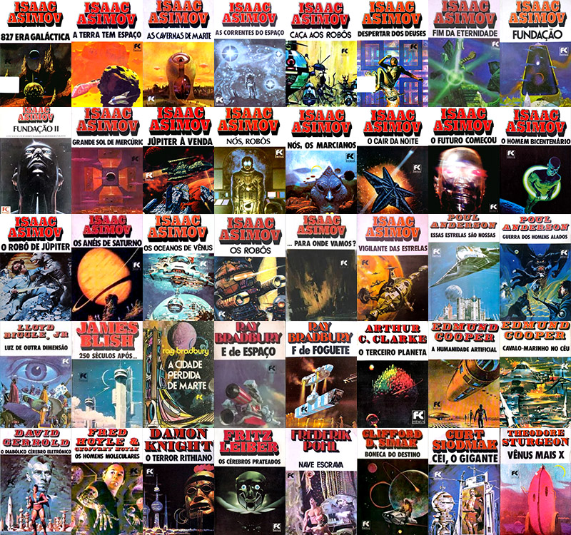
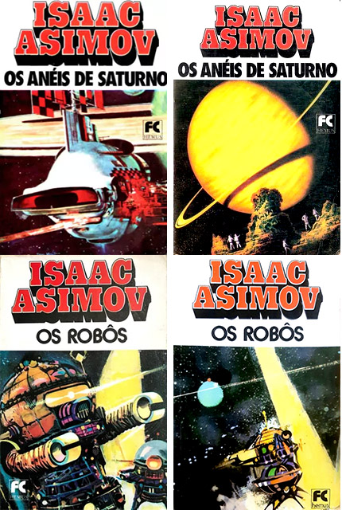

# epubs_fc_hemus

## O projeto

A **Hemus - Editora e Livraria**, nas décadas de 1970 e 1980 traduziu e publicou vários livros de ficção científica, a maioria de Isaac Asimov. As traduções foram realizadas por várias pessoas diferentes, e na época ainda não era usado o ISBN no Brasil para identificar livros. Algumas das traduções desses clássicos tem mais de 50 anos, e, se encontrados, estão em estado bem desgastado.

Nas versões da Hemus, alguns dos títulos foram alterados. Por exemplo, *The Caves of Steel* virou *Caça aos Robôs*.

A **Hemus** foi sucedida pela **Editora Record**, que inclusive lançou uma versão nacional da *Isaac Asimov Magazine* com 25 edições publicadas. Atualmente a **Aleph** tem publicado novas traduções das séries Império Galáctico, Robôs e Fundação de Isaac Asimov.

Em Novembro de 2025, comecei a scanear e preservar digitalmente as versões da Hemus, para ler no meu Kindle. Comecei com os livros do Asimov, e se conseguir, continuarei com os outros livros.

Estou digitalizando com um scanner de mesa OpticBook 3800L, e usando o software que acompanhou o scanner (Abbyy Fine Reader 12 Sprint) para fazer o OCR.

Estou fazendo versões em EPUB, porque podem ser facilmente editados e convertidos para outros formatos. Para gerar os epub, basta entrar na pasta `src` e rodar o script de PowerShell `build.ps1`.

A melhor forma de ler no Kindle é pegar o EPUB e usar o recurso Send to Kindle (https://www.amazon.com.br/sendtokindle), que será automaticamente convertido e enviado para seu Kindle. Caso tenha ativado o recursos de ver a capa do livro quando desligar o Kindle, funciona corretamente, assim como fontes embarcadas no livro.

Existe um software gratuito que pode fazer a conversão, mas não tenho tido resultados tão bons, além do fato dele adicionar um monte de porcaria no código fonte do livro, e de você precisar transferir para o Kindle por esse software para funcionar a capa do livro.

## Relação de Livros

No final dos livros existe uma relação de títulos, que foi usado para compilar esta lista. Nas informações dos livros normalmente não existe uma data de publicação da edição (ou das várias edições) nacionais, e alguns dos livros tiveram capas diferentes durante sua existência:

Aqui está uma lista dos livros da série FC Hemus em ordem alfabética por autor e título (alguns títulos originais precisam ser verificadas e estão sinalizada com `(*)`):

| Título                         | Autor                 | Ano de Publicação | Título Original                              | Ano de publicação Original |
| ------------------------------ | --------------------- | ---------------------- | -------------------------------------------- | ------------------------------------ |
| 827 Era Galáctica              | Isaac Asimov          |                        | Pebble in the Sky                            | 1950                                 |
| A Terra Tem Espaço             | Isaac Asimov          |                        | Earth  is Room Enough                        | 1957                                 |
| As Cavernas de Marte           | Isaac Asimov          | 1977                   | David Starr, Space Ranger                    | 1952                                 |
| As Correntes do Espaço         | Isaac Asimov          | 1981                   | The Currents of Space                        | 1952                                 |
| Caça aos Robôs                 | Isaac Asimov          |                        | The Caves of Steel                           | 1954                                 |
| Despertar dos Deuses           | Isaac Asimov          |                        | The Gods Themselves                          | 1972                                 |
| Fim da Eternidade              | Isaac Asimov          |                        | The End of Eternity                          | 1955                                 |
| Fundação                       | Isaac Asimov          |                        | Foundation Trilogy                           | 1951-1953                            |
| Fundação II                    | Isaac Asimov          |                        | Foundation’s Edge                            | 1982                                 |
| Júpiter à Venda                | Isaac Asimov          |                        | Buy Jupiter                                  | 1975                                 |
| Nós Robôs                      | Isaac Asimov          |                        | The Complete Robot                           | 1982                                 |
| Nós, os Marcianos              | Isaac Asimov          |                        | The Martian Way and Other Stories            | 1955                                 |
| O Cair da Noite                | Isaac Asimov          |                        | Nightfall and Other Stories                  | 1969                                 |
| O Futuro Começou               | Isaac Asimov          | 1978                   | The Early Asimov                             | 1972                                 |
| O Grande Sol de Mercúrio       | Isaac Asimov          |                        | Lucky Starr and the Big Sun of Mercury       | 1956                                 |
| O Homem Bicentenário           | Isaac Asimov          | 1980                   | The Bicentennial Man and Other Stories       | 1976                                 |
| O Robô de Júpiter              | Isaac Asimov          |                        | Lucky Starr and the Moons of Jupiter         | 1957                                 |
| Os Anéis de Saturno            | Isaac Asimov          |                        | Lucky Starr and the Rings of Saturn          | 1958                                 |
| Os Oceanos de Vênus            | Isaac Asimov          | 1980                   | Lucky Starr and the Oceans of Venus          | 1954                                 |
| Os Robôs                       | Isaac Asimov          |                        | The Naked Sun                                | 1957                                 |
| Para Onde Vamos?               | Isaac Asimov          |                        | Where Do We Go From Here?                    | 1971                                 |
| Vigilante das Estrelas         | Isaac Asimov          |                        | Lucky Starr and the Pirates of the Asteroids | 1953                                 |
| Essas Estrelas São Nossas      | Poul Anderson         |                        | We Claim These Stars!                        | 1959                                 |
| Guerra dos Homens Alados       | Poul Anderson         | 1978                   | War of the Wing-Men                          | 1958                                 |
| Luz de Outra Dimensão          | Lloyd Biggle Jr.      |                        | The Light That Never Was (*)                 | 1972                                 |
| 250 Séculos Após...            | James Blish           |                        | Midsummer Century (*)                        | 1972                                 |
| A Cidade Perdida de Marte      | Ray Bradbury          |                        | The Martian City (*)                         |                                      |
| E de Espaço                    | Ray Bradbury          |                        | S is for Space                               | 1966                                 |
| F de  Foguete                  | Ray Bradbury          |                        | R is for Rocket                              | 1962                                 |
| O Terceiro Planeta             | Arthur C. Clarke      |                        | Report on Planet Three (*)                   | 1972                                 |
| A Humanidade Artificial        | Edmund Cooper         |                        | The Overman Culture (*)                      | 1971                                 |
| Cavalo-Marinho no Céu          | Edmund Cooper         |                        | Seahorse in the Sky                          | 1969                                 |
| O Diabólico Cérebro Eletrônico | David Gerrold         |                        | When Harlie Was One (*)                      | 1972                                 |
| Os Homens Moleculares          | Fred e Geoffrey Hoyle |                        | The Molecule Men (*)                         | 1971                                 |
| O Terror Rithiano              | Damon Knight          |                        | The Rithian Terror                           | 1965                                 |
| Os Cérebros Prateados          | Fritz Leiber          |                        | The Silver Eggheads                          | 1961                                 |
| Nave Escrava                   | Frederick Pohl        |                        | Slave Ship                                   | 1956                                 |
| Boneca do Destino              | Clifford D. Simak     |                        | Destiny Doll                                 | 1971                                 |
| Cei, o Gigante                 | Curt Siodmak          |                        | City in the Sky (*)                          | 1974                                 |
| Venus Mais X                   | Theodore Sturgeon     |                        | Venus Plus X                                 | 1960                                 |

## Andamento do projeto

Vou atualizando este documento conforme as atividades são executadas.

### Resumo

|             | Realizado | %    |
| ----------- | --------- | ---- |
| Páginas     | 9906      | 100  |
| Localizado  | 7133      | 72,0 |
| Scaneadas   | 2130      | 21,5 |
| Convertidas | 1086      | 10,9 |
| Revisadas   | 82        | 0,8  |

### Detalhado

| Título                         | Páginas | Localizado | Scan | OCR  | EPUB | Revisado |
| ------------------------------ | ------- | ---------- | ---- | ---- | ---- | -------- |
| **827 Era Galáctica**          | 234     | ✅          | ✅    | ✅    | ✅    |          |
| A Terra Tem Espaço             | 206     | ✅          |      |      |      |          |
| **As Cavernas de Marte**       | 142     | ✅          | ✅    | ✅    |      |          |
| As Correntes do Espaço         | 206     | ✅          |      |      |      |          |
| **Caça aos Robôs**             | 296     | ✅          |      |      |      |          |
| Despertar dos Deuses           | 272     | ✅          | ✅    | ✅    |      |          |
| Fim da Eternidade              | 248     | ✅          |      |      |      |          |
| Fundação                       | 503     | ✅          |      |      |      |          |
| Fundação II                    | 372     | ✅          |      |      |      |          |
| Júpiter à Venda                | 236     | ✅          | ✅    | ✅    | ✅    |          |
| Nós Robôs                      | 559     |            |      |      |      |          |
| Nós, os Marcianos              | 256     | ✅          | ✅    | ✅    |      |          |
| O Cair da Noite                | 378     | ✅          | ✅    | ✅    | ✅    |          |
| O Futuro Começou               | 470     | ✅          |      |      |      |          |
| O Grande Sol de Mercúrio       | 193     | ✅          |      |      |      |          |
| O Homem Bicentenário           | 238     | ✅          | ✅    | ✅    | ✅    | 82       |
| O Robô de Júpiter              | 142     | ✅          |      |      |      |          |
| Os Anéis de Saturno            | 234     | ✅          |      |      |      |          |
| **Os Oceanos de Vênus**        | 190     | ✅          |      |      |      |          |
| Os Robôs                       | 146     | ✅          |      |      |      |          |
| Para Onde Vamos?               | 374     | ✅          | ✅    | ✅    |      |          |
| Vigilante das Estrelas         | 162     | ✅          |      |      |      |          |
| Essas Estrelas São Nossas      | 197     | ✅          |      |      |      |          |
| Guerra dos Homens Alados       | 224     |            |      |      |      |          |
| Luz de Outra Dimensão          | 228     | ✅          |      |      |      |          |
| 250 Séculos Após...            | 136     | ✅          |      |      |      |          |
| A Cidade Perdida de Marte      | 218     |            |      |      |      |          |
| E de Espaço                    | 202     | ✅          |      |      |      |          |
| F de  Foguete                  | 210     |            |      |      |      |          |
| O Terceiro Planeta             | 286     |            |      |      |      |          |
| A Humanidade Artificial        | 214     |            |      |      |      |          |
| Cavalo-Marinho no Céu          | 222     |            |      |      |      |          |
| O Diabólico Cérebro Eletrônico | 282     | ✅          |      |      |      |          |
| Os Homens Moleculares          | 286     |            |      |      |      |          |
| O Terror Rithiano              | 124     |            |      |      |      |          |
| Os Cérebros Prateados          | 220     |            |      |      |      |          |
| Nave Escrava                   | 168     | ✅          |      |      |      |          |
| Boneca do Destino              | 214     | ✅          |      |      |      |          |
| Cei, o Gigante                 | 210     |            |      |      |      |          |
| Venus Mais X                   | 178     | ✅          |      |      |      |          |

## Erros comuns de OCR

Aqui estão os erros mais comuns de OCR que foram encontrados na hora de revisar o texto, e corrigidos quando encontrados.

- *Corno* no lugar de *como*
- *Tomar* no lugar de *tornar*
- traço (-) no lugar de travessão (—)
- palavras que não foram emendadas quando separadas por traço no final da linha
  Quebras de parágrafo inexistentes nos finais de páginas

Em alguns dos livros, encontrei formas bem arcaicas de grafar as palavras. Na maioria dos casos corrigi para o usado na época:

* *cinquenta* estava grafado *cincoenta*.

