# epubs_fc_hemus

## O projeto

A **Hemus - Editora e Livraria**, na década de 1970, traduziu e publicou vários livros de ficção científica, a maioria de Isaac Asimov. As traduções foram realizadas por várias pessoas diferentes, e na época ainda não era usado o ISBN no Brasil para identificar livros. Na década de 80, a coleção foi expandida posteriormente e quase todos os livros foram relançados com uma nova capa, mais moderna, com uma faixa branca contendo o nome do autor e do livro. Essas versões novas usavam arte de outros livros da época, ocultando o nome do artista.

Algumas das traduções desses clássicos tem mais de 50 anos, e, se encontrados, estão em estado bem desgastado.

A **Hemus** foi sucedida pela **Editora Record**, que inclusive lançou uma versão nacional da *Isaac Asimov Magazine* com 25 edições publicadas. Atualmente a **Aleph** tem publicado novas traduções das séries Império Galáctico, Robôs e Fundação de Isaac Asimov.

Nas versões da Hemus, vários títulos foram adaptados. Por exemplo, *The Caves of Steel* virou *Caça aos Robôs*.

Edições originais:

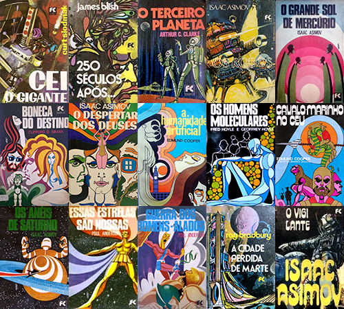

Reedições e novos lançamentos:

Em Novembro de 2025, comecei a scanear e preservar digitalmente as versões atualizadas da Hemus, para ler no Kindle. Comecei com os livros do Asimov, e se conseguir, continuarei com os outros livros.

Estou digitalizando com um scanner de mesa OpticBook 3800L, e usando o software que acompanhou o scanner (Abbyy Fine Reader 12 Sprint) para fazer o OCR.

Estou fazendo versões em EPUB, porque podem ser facilmente editados e convertidos para outros formatos. Para gerar os epub, basta navegar até a pasta `src` e rodar o script de PowerShell `build.ps1`.

A melhor forma de ler no Kindle é pegar o EPUB e usar o recurso Send to Kindle (https://www.amazon.com.br/sendtokindle), que será automaticamente convertido e enviado para seu Kindle. Caso tenha ativado o recursos de ver a capa do livro quando desligar o Kindle, funciona corretamente, assim como fontes embarcadas no livro.

Existe um software gratuito que pode fazer a conversão, mas não tenho tido resultados tão bons, além do fato dele adicionar um monte de porcaria no código fonte do livro, e de você precisar transferir para o Kindle por esse software para funcionar a capa do livro.

## Relação de Livros

No final dos livros existe uma relação de títulos, que foi usado para compilar esta lista. Nas informações dos livros normalmente não existe uma data de publicação da edição (ou das várias edições) nacionais.

Aqui está uma lista dos livros da série FC Hemus em ordem alfabética por autor e título:

| Título                             | Título Original                                     | Autor                 | Tradução                                                   |
| ---------------------------------- | --------------------------------------------------- | --------------------- | ---------------------------------------------------------- |
| **827 Era Galáctica**              | Pebble in the Sky (1950)                            | Isaac Asimov          | - Agatha M. Auersperg                                      |
| **A Terra Tem Espaço**             | Earth  is Room Enough (1957)                        | Isaac Asimov          | - Affonso Blacheyre                                        |
| **As Cavernas de Marte**           | David Starr, Space Ranger (1952)                    | Isaac Asimov          | - Agatha M. Auersperg                                      |
| **As Correntes do Espaço**         | The Currents of Space (1952)                        | Isaac Asimov          | - Luiz Roberto de Godoi Vidal                              |
| **Caça aos Robôs**                 | The Caves of Steel (1954)                           | Isaac Asimov          | - Agatha M. Auersperg                                      |
| **Despertar dos Deuses**           | The Gods Themselves (1972)                          | Isaac Asimov          | - Edith de Carvalho Negraes                                |
| **Fim da Eternidade**              | The End of Eternity (1955)                          | Isaac Asimov          | - Luiz Carlos Ascênio Nunes                                |
| Fundação                           | Foundation Trilogy (1951-53)                        | Isaac Asimov          |                                                            |
| **Fundação II**                    | Foundation’s Edge (1982)                            | Isaac Asimov          |                                                            |
| **Júpiter à Venda**                | Buy Jupiter (1975)                                  | Isaac Asimov          | - Attílio Cancian                                          |
| Nós Robôs                          | The Complete Robot (1982)                           | Isaac Asimov          |                                                            |
| **Nós, os Marcianos**              | The Martian Way and Other Stories (1955)            | Isaac Asimov          | - Agatha M. Auersperg                                      |
| **O Cair da Noite**                | Nightfall and Other Stories (1969)                  | Isaac Asimov          | - Maria Judith Martins                                     |
| **O Futuro Começou**               | The Early Asimov (1972)                             | Isaac Asimov          |                                                            |
| **O Grande Sol de Mercúrio** (1)   | Lucky Starr and the Big Sun of Mercury (1956)       | Isaac Asimov          | - Agatha M. Auersperg                                      |
| **O Homem Bicentenário**           | The Bicentennial Man and Other Stories (1976)       | Isaac Asimov          | - Luiz Roberto S. S. Malta                                 |
| **O Robô de Júpiter**              | Lucky Starr and the Moons of Jupiter (1957)         | Isaac Asimov          | - Lindbergh C. de Oliveira                                 |
| **Os Anéis de Saturno**            | Lucky Starr and the Rings of Saturn (1958)          | Isaac Asimov          | - Agatha M. Auersperg                                      |
| **Os Oceanos de Vênus**            | Lucky Starr and the Oceans of Venus (1954)          | Isaac Asimov          | - Agatha M. Auersperg                                      |
| **Os Robôs**                       | The Naked Sun (1957)                                | Isaac Asimov          | - Jonas Carmargo Leite                                     |
| **Para Onde Vamos?**               | Where Do We Go From Here? (1971)                    | Isaac Asimov          | - Maria Judith Martins - Danusa Scarton Rabello Alves |
| **Vigilante das Estrelas**         | Lucky Starr and the Pirates of the Asteroids (1953) | Isaac Asimov          | - Attílio Cancian                                          |
| **Essas Estrelas São Nossas**      | We Claim These Stars! (1959)                        | Poul Anderson         | - Affonso Blacheyre                                        |
| Guerra dos Homens Alados           | War of the Wing-Men (1958)                          | Poul Anderson         |                                                            |
| **Luz de Outra Dimensão**          | The Light That Never Was (1972)                     | Lloyd Biggle Jr.      | - Maria Judith Martins                                     |
| **250 Séculos Após...**            | Midsummer Century (1972)                            | James Blish           | - Attílio Cancian                                          |
| A Cidade Perdida de Marte          | I Sing the Body Electric (1969)                     | Ray Bradbury          |                                                            |
| E de Espaço                        | S is for Space (1966)                               | Ray Bradbury          |                                                            |
| **F de  Foguete**                  | R is for Rocket (1962)                              | Ray Bradbury          |                                                            |
| **O Terceiro Planeta**             | Report on Planet Three (1972)                       | Arthur C. Clarke      | - Attílio Cancian                                          |
| **A Humanidade Artificial**        | The Overman Culture (1971)                          | Edmund Cooper         | - Agatha Maria Auersperg                                   |
| **Cavalo-Marinho no Céu**          | Seahorse in the Sky (1969)                          | Edmund Cooper         | - Agatha Maria Auersperg                                   |
| **O Diabólico Cérebro Eletrônico** | When Harlie Was One (1972)                          | David Gerrold         | - Agatha Maria Auersperg                                   |
| **Os Homens Moleculares**          | The Molecule Men (1971)                             | Fred e Geoffrey Hoyle | - Agatha Maria Auersperg                                   |
| **O Terror Rithiano**              | The Rithian Terror (1965)                           | Damon Knight          | - Agatha M. Auersperg                                      |
| Os Cérebros Prateados              | The Silver Eggheads (1961)                          | Fritz Leiber          |                                                            |
| **Nave Escrava**                   | Slave Ship (1956)                                   | Frederick Pohl        | - Agatha Auersperg                                         |
| **Boneca do Destino**              | Destiny Doll (1971)                                 | Clifford D. Simak     | - Affonso Blacheyre                                        |
| **Cei, o Gigante**                 | City in the Sky (1974)                              | Curt Siodmak          | - Sandra de Negraes Brisolla                               |
| **Venus Mais X**                   | Venus Plus X (1960)                                 | Theodore Sturgeon     | - Agatha M. Auersperg                                      |

(1) Nas primeira edições e dentro do livro, o título aparece como "O Grande Sol de Mercúrio". Na capa das últimas edições aparece só "Grande Sol de Mercúrio"

Alguns dos livros tiveram capas diferentes durante sua existência:

A segunda capa de Os Robôs usa a ilustração da capa da primeira edição da Hemus, e a terceira usa a ilustração da contracapa.

## Capas das Reedições

Nas versões nacionais de livros, geralmente as ilustrações são as mesmas das publicações originais, mas neste caso foram aproveitadas de outros livros também. O artista não está creditado na maioria dos livros, e não sei se eram obtidas permissões para uso das imagens, pois foram cortadas as assinaturas dos artistas na maioria das capas. Pesquisando, consegui levantar a seguinte relação de artistas, e onde a arte foi originalmente usada.

Em várias das reedições, ainda consta o nome do artista da versão original na página de Copyright ("Edú", ou "Decio Guedes"), indicando que o miolo provavelmente é da primeira edição, e que foi encapado novamente, ou que foram aproveitadas os mesmos fotolítos para as edições subsequentes, sem alterações.

| Título                                                       | Publicação Original                                          | Artista                    |
| ------------------------------------------------------------ | ------------------------------------------------------------ | -------------------------- |
| **827 Era Galáctica** 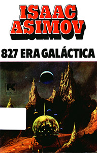 | Pebble in the Sky (Fawcett, 1971) 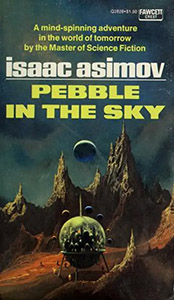 | Paul Lehr                  |
| **A Terra Tem Espaço** 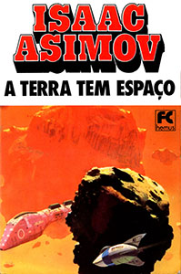 | The Early Asimov Volume 2 (Panther, 1974 ) 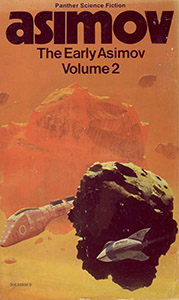 | Chris Foss                 |
| **As Cavernas de Marte** 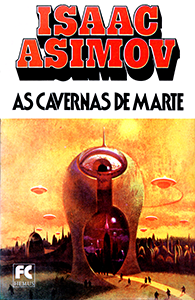 | Nine Tomorrows (Fawcett, 1969) 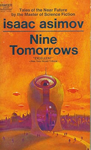 | Paul Lehr                  |
| **As Correntes do Espaço** 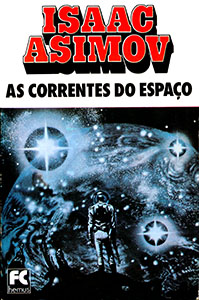 | AudioLP The Green Hills of Earth (Caedmon Records, 1977) 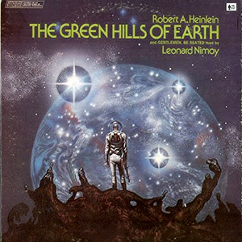 | Frank Kelly Freas          |
| **Caça aos Robôs** 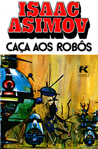 | I, Robot (Fawcett, 1970) 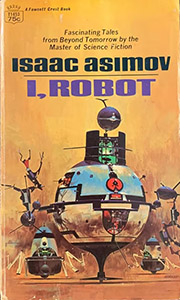        | John Berkey                |
| **Despertar dos Deuses** 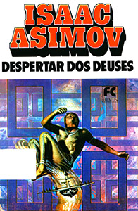 | The Best of Isaac Asimov (Fawcett, 1976) 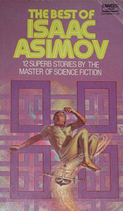 | (Artista não identificado) |
| **Fim da Eternidade** 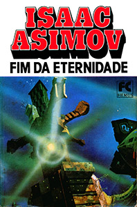 | Foundation and Empire (Panther, 1973)  | Chris Foss                 |
| Fundação                                                     | The Stars Like Dust (Fawcett, 1972) 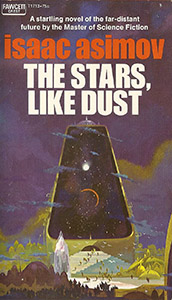 | Paul Lehr                  |
| **Fundação II** 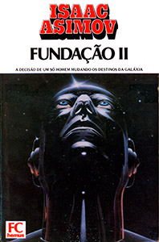       | Omni Magazine - Outubro 1982 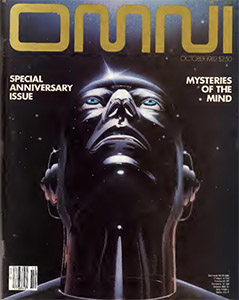 | Dickran Palulian           |
| **Júpiter à Venda**  | The Best of Trek (Signet, 1978) 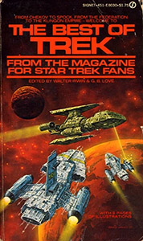 | Eddie Jones                |
| Nós Robôs 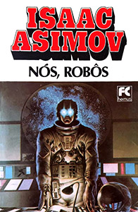               | Time and Again (Ace, 1976) 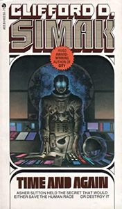 | Michael Whelan             |
| **Nós, os Marcianos** 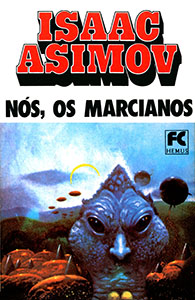 | The Asutra (Dell, 1974)       | Paul Lehr                  |
| **O Cair da Noite** 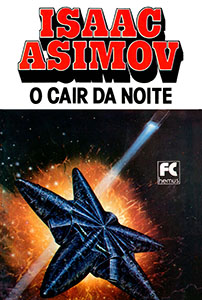 | Through a Glass Clearly (New English Library, 1978) 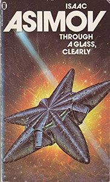 | Tim White                  |
| **O Futuro Começou** 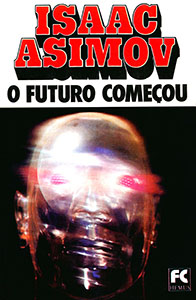 | I, Robot (Panther, 1969) 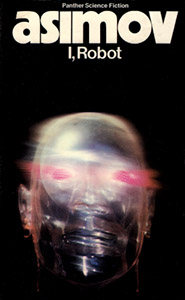     |                            |
| **O Grande Sol de Mercúrio** (1)  | The End of Eternity (Fawcett, 1971) 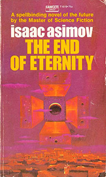 | Paul Lehr                  |
| **O Homem Bicentenário** 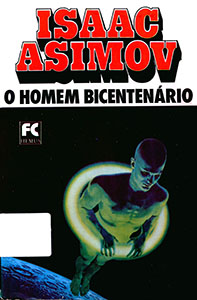 | Omni Magazine - Maio 1980 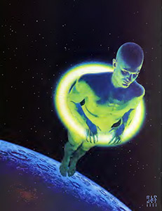 | Richard Cohen              |
| **O Robô de Júpiter**                              | Lucky Starr and the Moons of Jupiter (Fawcett, 1978) 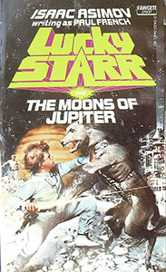 | John Berney                |
| **Os Anéis de Saturno**                            |                                                              |                            |
| **Os Oceanos de Vênus**  | Lucky Starr and the Oceans of Venus (Fawcett, 1978) 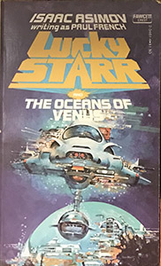 | Don Maitz                  |
| **Os Robôs**                                       | Arte Original, 1974 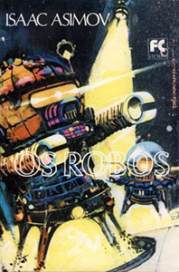            | Décio Guedes               |
| **Para Onde Vamos?** 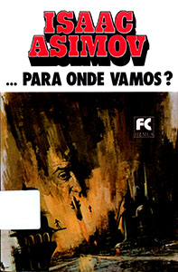 | The Three Stigmata of Palmer Eldritch (MacFadden, 1966) 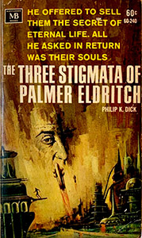 | Jack Faragasso             |
| **Vigilante das Estrelas** 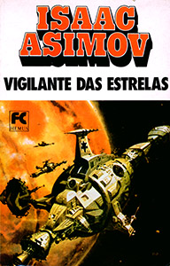 | Buy Jupiter (Panther, 1975) 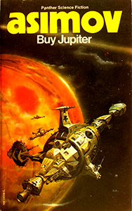 | Peter Andrew Jones         |
| **Essas Estrelas São Nossas** 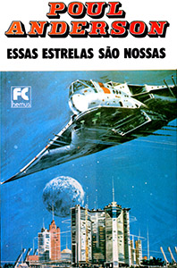 | Analog Science Fiction - Abril 1977 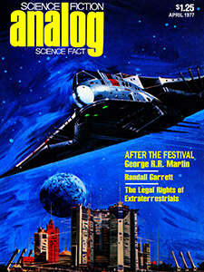 | Vincent DiFate             |
| Guerra dos Homens Alados                                     | Hot Stuff #4 (1977) 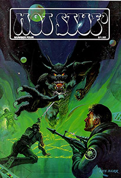         | Ken Barr                   |
| **Luz de Outra Dimensão** 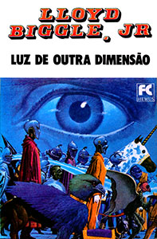 | The Siege of Wonder (DAW, 1976) 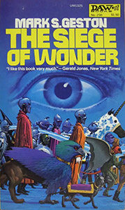 | H. R. Van Dongen           |
| **250 Séculos Após...** 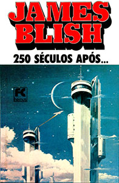 | Pintura *Urban Monad 116* - 1980 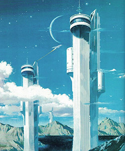 | Vincent DiFate             |
| A Cidade Perdida de Marte                                    | Arte original, 1975                                          | Décio Guedes               |
| E de Espaço                                                  | Foundation (Panther, 1960) 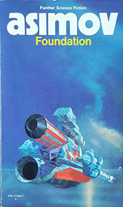   | Chris Foss                 |
| **F de  Foguete** 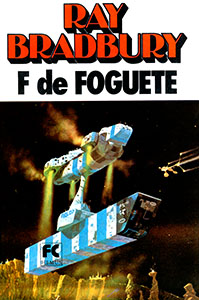    | The Early Asimov Volume 1 (Panther, 1973) 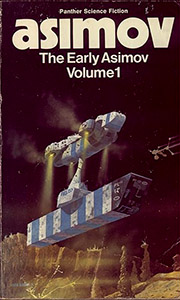 | Chris Foss                 |
| **O Terceiro Planeta** 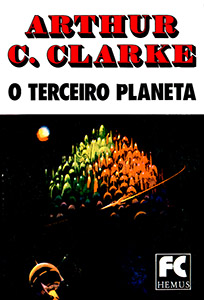 | The Martian Way and Other Stories (Fawcett, 1969) 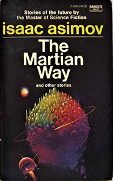 | Paul  Lehr                 |
| **A Humanidade Artificial** 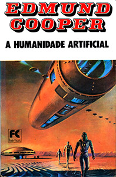 | Equator (New English Library, 1973) 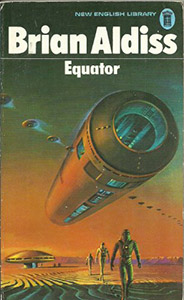 | Bruce Pennington           |
| **Cavalo-Marinho no Céu** 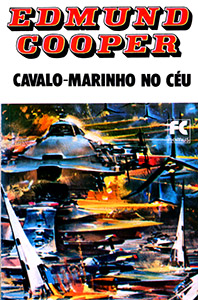 | Lucky Starr and the Pirates of the Asteroids (Fawcett, 1978)  | John Berkey                |
| **O Diabólico Cérebro Eletrônico**  | Double Star (Signet, 1979)   | Vincent DiFate             |
| **Os Homens Moleculares**  | The Caves of Steel (Fawcett, 1972)  | John Berkey                |
| **O Terror Rithiano**  | To Live Forever (Ballantine, 1976)  | Dean Ellis                 |
| Os Cérebros Prateados                                        | In the Wake of Man (Bobbs-Merrill, 1975)  | Nick Aristovulos           |
| **Nave Escrava**      | Slave Ship (Ballantine, 1969)  | Robert Foster              |
| **Boneca do Destino**  | We Who Are About To (Dell, 1977)  | (Artista não identificado) |
| **Cei, o Gigante**   | The Best of Philip K Dick (Ballantine, 1977)  | Vincent DiFate             |
| **Venus Mais X**      | Earth is Room Enough (Fawcett, 1970)  | Paul Lehr                  |

## Andamento do projeto

Vou atualizando este documento conforme as atividades são executadas.

### Resumo

|             | Realizado | %     |
| ----------- | --------- | ----- |
| Páginas     | 9906      | 100,0 |
| Localizado  | 9129      | 92,2  |
| Scaneadas   | 5281      | 53,3  |
| Convertidas | 1147      | 11,6  |
| Revisadas   | 296       | 3,0   |

### Detalhado

| Título                             | Páginas | Localizado | Scan    | OCR  | EPUB | Revisado |
| ---------------------------------- | ------- | ---------- | ------- | ---- | ---- | -------- |
| **827 Era Galáctica**              | 234     | ✅          | ✅       | ✅    | ✅    |          |
| **A Terra Tem Espaço**             | 206     | ✅          | ✅       | ✅    |      |          |
| **As Cavernas de Marte**           | 142     | ✅          | ✅       | ✅    |      |          |
| **As Correntes do Espaço**         | 206     | ✅          | ✅       | ✅    |      |          |
| **Caça aos Robôs**                 | 296     | ✅          | ✅       | ✅    |      |          |
| **Despertar dos Deuses**           | 272     | ✅          | ✅       | ✅    |      |          |
| **Fim da Eternidade**              | 248     | ✅          | ✅       | ✅    |      |          |
| Fundação                           | 503     | ✅          |         |      |      |          |
| **Fundação II**                    | 372     | ✅          | 370 (2) |      |      |          |
| **Júpiter à Venda**                | 236     | ✅          | ✅       | ✅    | ✅    |          |
| Nós Robôs                          | 559     |            |         |      |      |          |
| **Nós, os Marcianos**              | 256     | ✅          | ✅       | ✅    |      |          |
| **O Cair da Noite**                | 378     | ✅          | ✅       | ✅    | ✅    | 280      |
| **O Futuro Começou**               | 470     | ✅          |         |      |      |          |
| **O Grande Sol de Mercúrio**       | 193     | ✅          | ✅       | ✅    |      |          |
| **O Homem Bicentenário**           | 238     | ✅          | ✅       | ✅    | ✅    | 82       |
| **O Robô de Júpiter**              | 142     | ✅          |         |      |      |          |
| **Os Anéis de Saturno**            | 234     | ✅          |         |      |      |          |
| **Os Oceanos de Vênus**            | 190     | ✅          | ✅       | ✅    |      |          |
| **Os Robôs**                       | 146     | ✅          |         |      |      |          |
| **Para Onde Vamos?**               | 374     | ✅          | ✅       | ✅    |      |          |
| **Vigilante das Estrelas**         | 162     | ✅          | ✅       | ✅    |      |          |
| **Essas Estrelas São Nossas**      | 197     | ✅          |         |      |      |          |
| Guerra dos Homens Alados           | 224     | ✅          |         |      |      |          |
| **Luz de Outra Dimensão**          | 228     | ✅          |         |      |      |          |
| **250 Séculos Após...**            | 136     | ✅          | ✅       | ✅    |      |          |
| A Cidade Perdida de Marte (1)      | 218     |            |         |      |      |          |
| E de Espaço                        | 202     | ✅          |         |      |      |          |
| **F de  Foguete**                  | 210     | ✅          | ✅       | ✅    |      |          |
| **O Terceiro Planeta**             | 286     | ✅          | ✅       | ✅    |      |          |
| **A Humanidade Artificial**        | 214     | ✅          |         |      |      |          |
| **Cavalo-Marinho no Céu**          | 222     | ✅          | ✅       | ✅    |      |          |
| **O Diabólico Cérebro Eletrônico** | 282     | ✅          |         |      |      |          |
| **Os Homens Moleculares**          | 286     | ✅          | ✅       | ✅    | 162  |          |
| **O Terror Rithiano**              | 124     | ✅          | ✅       | ✅    |      |          |
| Os Cérebros Prateados              | 220     | ✅          |         |      |      |          |
| **Nave Escrava**                   | 168     | ✅          | ✅       | ✅    |      |          |
| **Boneca do Destino**              | 214     | ✅          |         |      |      |          |
| **Cei, o Gigante**                 | 210     | ✅          |         |      |      |          |
| **Venus Mais X**                   | 178     | ✅          | ✅       | ✅    |      |          |

(1) Parece que este livro não foi lançado com uma capa "moderna"

(2) Faltam duas páginas que estão coladas

## Erros comuns de OCR

Aqui estão os erros mais comuns de OCR que foram encontrados na hora de revisar o texto, e corrigidos quando encontrados.

- *Corno* no lugar de *como*
- *Tomar* no lugar de *tornar* (e retomar no lugar de retornar)
- traço (-) no lugar de travessão (—)
- ah no lugar de ali
- palavras que não foram emendadas quando separadas por traço no final da linha
  Quebras de parágrafo inexistentes nos finais de páginas

Em alguns dos livros, encontrei formas bem arcaicas de grafar as palavras. Na maioria dos casos corrigi para o usado na época:

* *cinquenta* estava grafado *cincoenta*.

